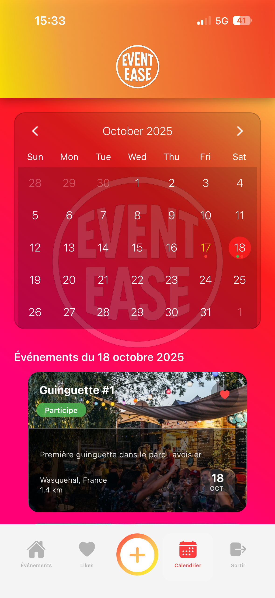

# EventEase

Application mobile React Native de gestion d'événements avec authentification locale, CRUD complet, calendrier, météo et géolocalisation.

## Fonctionnalités

L'application répond entièrement aux besoins du cahier des charges avec des ajouts significatifs pour améliorer l'expérience utilisateur et la sécurité.

### ✅ Fonctionnalités obligatoires (toutes implémentées)
- **Connexion / Inscription** avec validation complète des données
- **Liste des événements** avec informations détaillées et filtres
- **CRUD complet** des événements (Créer, Lire, Modifier, Supprimer)
- **Marquer un événement comme « participé »** avec persistance
- **Persistance locale des données** via AsyncStorage avec structure optimisée

### ✅ Fonctionnalités optionnelles (toutes implémentées)
- **Affichage calendrier** avec vue mensuelle et marqueurs d'événements
- **Intégration API météo** (Open-Meteo) avec prévisions détaillées
- **Amélioration graphique** : thème dégradé, icônes vectorielles et splash screen
- **Géolocalisation** avec calcul automatique des distances et affichage sur carte

### ✅ Ajouts personnels pour plus de sécurité et fluidité
- **Authentification sécurisée** :
  - Hashage SHA-256 avec salt personnalisé
  - Validation stricte des mots de passe (longueur, majuscules, caractères spéciaux)
  - Protection contre la réutilisation d'emails
- **Architecture performante** :
  - Stockage par clés indexées pour optimiser les performances UX
  - Feature-Based Architecture pour une meilleure maintenabilité
- **Fonctionnalités sociales** :
  - Système de likes avec écran dédié aux événements favoris
  - Gestion des permissions utilisateur (suppression et modification uniquement des événements créés)
- **Expérience utilisateur avancée** :
  - Sélection d'images depuis la galerie photo pour illustrer les événements
  - Navigation fluide avec gestes de swipe et animations
- **Fonctionnalités de localisation** :
  - Intégration react-native-maps pour visualisation
  - Calcul et affichage de la distance en temps réel
  - Géocodage automatique des adresses

## Architecture

```
app/                     # Point d'entrée Expo Router

src/
├── components/          # Composants réutilisables
│   ├── common/          # Composants UI génériques
│   │   └── styles/      # Styles des composants communs
│   └── style/           # Styles globaux de l'application
├── features/            # Features par domaine métier
│   └── {featureName}/   # auth, events, eventDetail
│       ├── components/  # Composants spécifiques à la feature
│       ├── hooks/       # Hooks métier de la feature
│       └── styles/      # Styles de la feature
├── services/
│   ├── storage/         # Gestion AsyncStorage
│   └── api/             # Services API externes
├── navigation/
│   ├── flows/          # Flux de navigation (Auth, Main)
│   └── hooks/          # Hooks de navigation
├── contexts/           # Contexts React (état global)
├── animations/         # Animations et transitions
└── config/             # Configuration et variables d'environnement
```

## Variables d'environnement

Créer un fichier `.env` :
```bash
EXPO_PUBLIC_PASSWORD_SALT=your_secure_salt_here_min_16_chars
```

Le salt est utilisé pour hasher les mots de passe via expo-crypto.

## Technologies

- **React Native** (Expo SDK 54) + TypeScript
- **AsyncStorage** pour la persistance locale
- **expo-crypto** pour le hashage des mots de passe
- **react-native-calendars** pour la vue calendrier
- **expo-location** pour la géolocalisation
- **Open-Meteo API** pour la météo (gratuite, sans clé)
- **expo-linear-gradient** pour les effets visuels

## Installation

```bash
npm install
npm start
```

## Aperçu de l'application

### Vue Liste des événements


### Vue Calendrier


